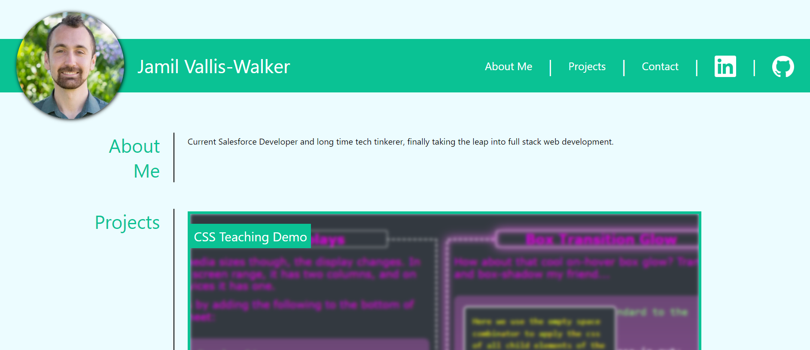

# Challenge 2 - Portfolio

## Description

This project is a professional portfolio website. It demos projects I've completed to date, as well as holding several placeholder spots to display future works. It also includes some information about me, links to other professional websites such as LinkedIn and Github, and as well as a means of contacting me.

## Link

You can find the active site page at the following link:
https://jvalliswalker.github.io/C2-Profile/